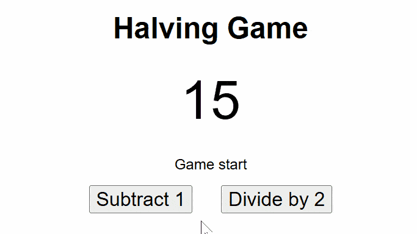

# Halving Game
- Simple number game involving two players
- Game starts with a number (positive integer)
- Two players take turns to either _subtract 1_ or _divide by 2_
- Whoever reduces the number to zero wins

## Game Demo

## Tech Specs
- Minimal implementation
- Player 1 moves first and is the human player
- Player 2 is the AI agent using minimax algorithm
- HTML/CSS for UI, JavaScript for game logic

## User Interface
- Current number `n`
- Two buttons `Subtract 1` and `Divide by 2` to collect human player input

## Minimax Algorithm
- Simulates the game until game end and picks the _best_ outcome (recursion)
- Assumes both players play optimally
- On the agent's turn, it picks the action that _maximizes_ outcome for agent
- On the opponent's turn, it picks the action that _minimizes_ outcome for agent

## Credit
[Stanford CS 221](https://www.youtube.com/watch?v=3pU-Hrz_xy4)